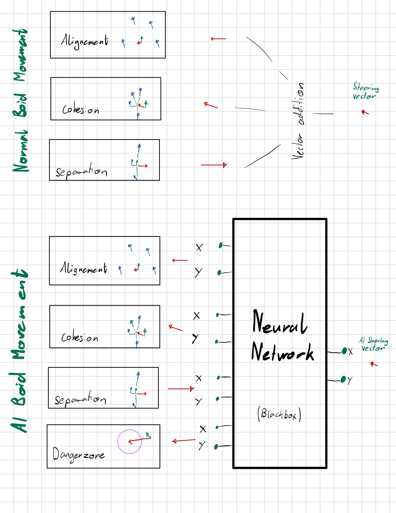
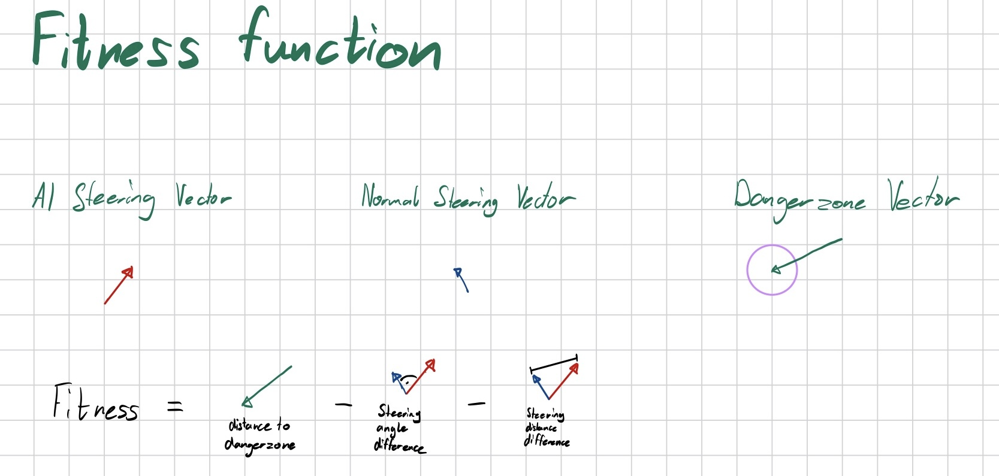
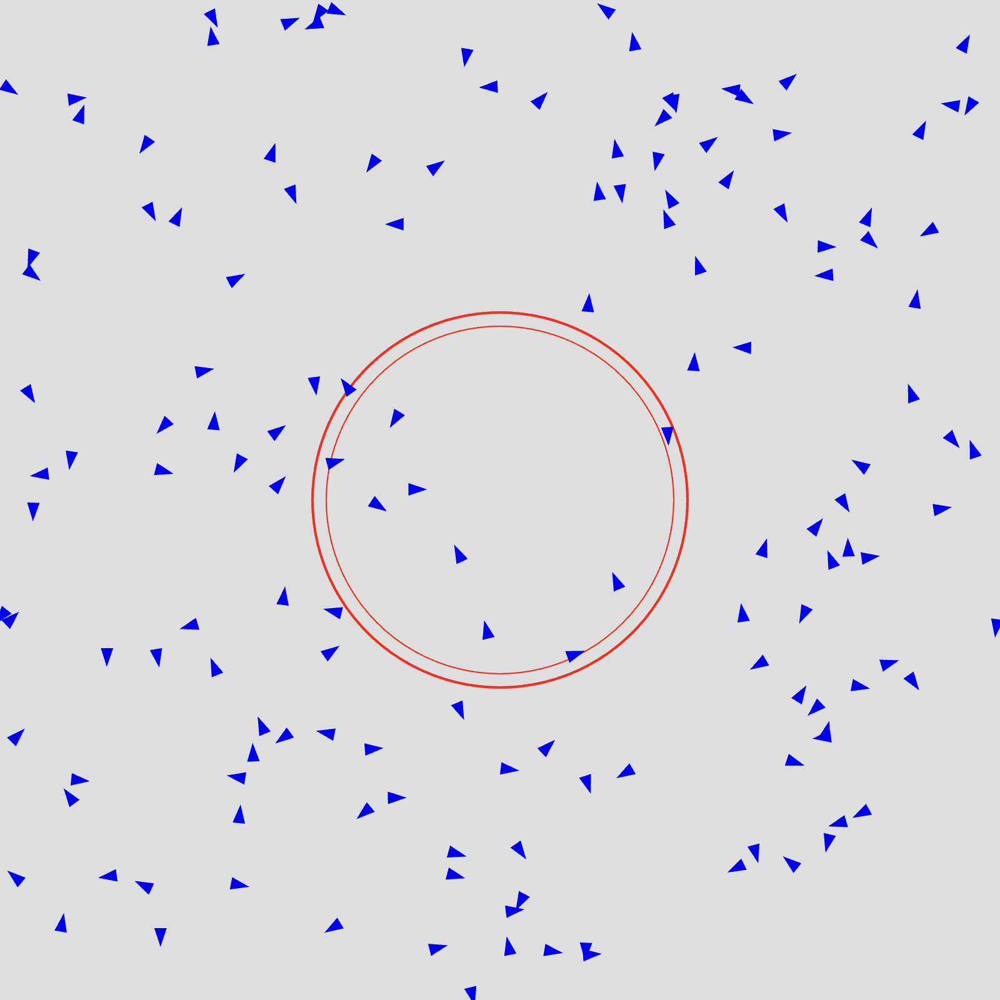

# Introduction

This project explores the intersection of **reinforcement learning**, **neuroevolution**, and **emergent behavior** in simulated swarms.

## Reinforcement Learning

Reinforcement Learning (RL) is a type of machine learning where an agent learns by interacting with an environment. It receives **rewards** or **penalties** for its actions and adjusts its behavior to maximize reward.

> Think of it like training a dog with treats — good actions get rewarded, and over time the dog learns a behavior pattern.

## NEAT: NeuroEvolution of Augmenting Topologies

**NEAT** is an evolutionary (genetic) algorithm that evolves both the **weights** and **topologies** (structure) of neural networks.

Key features:

- Starts simple and complexifies over generations.
- Uses genetic algorithms to mutate and recombine networks.
- Tracks innovation to align genomes during crossover.

> NEAT allows agents to develop their own neural architectures over time — not just improve existing ones.

📖 [Original NEAT paper (Stanley & Miikkulainen, 2002)](http://nn.cs.utexas.edu/downloads/papers/stanley.ec02.pdf)

## Boids: Flocking Behavior

**Boids** simulate flocking with three simple steering rules:

1. **Alignment** — Steer in the same direction as nearby boids.
2. **Cohesion** — Move toward the average position of nearby boids.
3. **Separation** — Avoid crowding too closely.

Despite the simplicity of these rules, boids exhibit complex and realistic group motion.

_Images from [Wikipedia](https://en.wikipedia.org/wiki/Boids)_

# Method

## Overview

In this project, an agent is trained via NEAT to mimic boid behavior —
using alignment, cohesion, and separation vectors from how normal boids behavior is
calculated - and adding a fourth vector that points to the danger zone as **input vectors**.

## Fitness Function

The agent receives a fitness score based on how well it follows normal boid movement and how good it avoids the danger zone.

## Training Process

For the training, one boid per genome is created and they're all placed randomly in the same environment. My configuration sets 150 genomes per generation.

After a set time the population is evolved and the next generation is randomly placed in the environment.

A circle that represents the danger zone is drawn in the middle of the canvas.

The total fitness of a boid is the average of the fitness over its lifetime, which is calculated every frame.

# Reflections

## Challenges

- **Balancing fitness**: Ensuring the agent learns to avoid danger while still mimicking boid behavior.
- **Vectors in neural networks**: Effectively encoding the boid behavior vectors as inputs for the NEAT agent.
- **Training stability**: Maintaining consistent performance across generations without overfitting to specific behaviors.

## Future Work

- **Deterministic environment**: Implementing a more controlled environment to reduce randomness.
- **Separate fitness metrics**: Using distinct fitness scores for boid behavior and danger avoidance to refine learning.
- **One simulation per genome**: Running each genome in its own simulation to reduce interference.
- **Visualization**: Enhancing visualizations of the neural network, fitness evolution, and NEAT process.
- **Parameter tuning**: Experimenting with different NEAT parameters to optimize learning.
- **Environment improvements**: Improving wrapping and boundary conditions to better simulate real-world scenarios.
